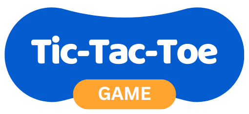

<h1 align="center">
 
  
 
 
TIC-TAC-TOE
</h1>

The famous tic-tac-toe game developed in React.

  

 

    

 

## Features

This app features all the latest tools and practices in mobile development!

- ⚛️ **React Js** — A JavaScript library for building user interfaces
- ⚛️ **Next JS** — The React Framework for the Web
- 💹 **Node Js** — A web framework for Node Js

## Getting started

1. Clone this repo using `git clone git@github.com:fabiocordeiroaraujo/tic-tac-toe.git`
2. Move yourself to the appropriate directory: `cd tic-tac-toe` 
3. Run `npm install` to install dependencies 
4. Run `npm run build` to build the project
4. Run `npm start` to start the server

## License

This project is licensed under the MIT License - see the [LICENSE](https://opensource.org/licenses/MIT) page for details.